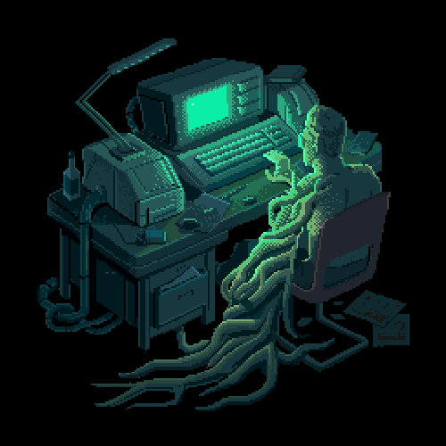

## 👋 About Me

  

I'm a student passionate about cybersecurity and always eager to learn more about the field.
I enjoy learning through practice, building projects, and exploring different areas of cyber with a strong interest in growth and consistency.

- Cybersecurity student
- Practical learner
- Building skills step by step

---

## 🧩 Reverse Engineering

  

Reverse engineering is one of the areas I enjoy the most.
I like understanding how software works internally, analyzing binaries, and learning how execution flow, functions, and low-level behavior connect together.

- Learning RE fundamentals
- Exploring binaries and control flow
- Improving analysis through practice

---

## 🚀 Cyber Projects

  

I enjoy building cybersecurity projects that help me learn by doing.
I’m currently working on a **QR Security** project and using hands-on work to strengthen my technical understanding.

- Building practical cyber projects
- Currently working on **QR Security**
- Learning through implementation and testing

---

## 🛡 SOC Path

  

I’m currently studying and working toward a future role in the **SOC** field.
I’m especially interested in monitoring, analysis, blue team thinking, and understanding how defenders detect and respond to threats.

- Future SOC goal
- Blue team mindset
- Detection and monitoring interest

---

## 🔍 Cybersecurity Interests

  

I’m interested in many areas across the cybersecurity world.
What keeps me motivated is how broad this field is and how every topic opens the door to deeper learning.

- Reverse Engineering
- Blue Team fundamentals
- SOC and detection
- Malware behavior analysis
- Labs, challenges, and hands-on learning

---

## 🛠 Core Skills (Practical)

- Reverse Engineering fundamentals (static + basic dynamic analysis)
- Linux CLI (daily usage) + Bash basics
- Networking fundamentals (TCP/IP, ports, protocols)
- Web security basics (common vulnerabilities in labs)
- Intro forensics (PCAP, logs)

---

## 🧪 Platforms & Practice

- TryHackMe (CTFs & learning paths)
- Boot2Root-style labs
- CrackMe challenges
- Malware analysis labs (beginner level)

> Optional: add your profiles here
- TryHackMe: https://tryhackme.com/p/NK179
- Portfolio: https://naeim179.github.io/naeem_web/

---

## 🧰 Tools I Use (Basics)

- 🧩 Ghidra (reverse engineering basics)
- 🔎 Wireshark / tshark (traffic inspection)
- 🪟 Sysmon / Event Viewer (Windows log viewing)
- 🧾 YARA (learning rules) • Sigma (learning detections)